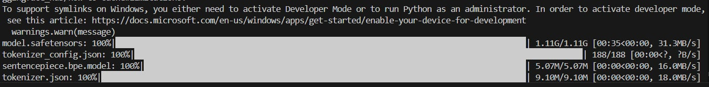

## Prerequisites

The project expects a python version >= 3.10, so make sure you create the venv with a similar to higher version of python.

In order to start the project, first you need a couple of things:
Create a virtual environment

```
python -m venv <venv-name>
```

Activate the virtual environment. For linux execute the following command:

```
source <venv-name>/bin/activate
```

and for windows:

```
source <venv-name>/Scripts/activate
```

Then you need to install tha package into the virtual environment.
The example below will make an editable install of the package (more can be read here: https://setuptools.pypa.io/en/latest/userguide/development_mode.html). Take note the command has to be executed within an activated virtual environment and from the root folder, where the pyproject.toml file is located.

```
pip install -e .
```

The installation make take a couple of minutes depending on the machine on which it is installed.

After that, there are two ways to use the project.

## Running the API

To run the api we need the uvicorn server.
There are two options to start the API. First one is via:

```
uvicorn src.cm_evaluator.api.main:app --reload
```

You can also specify various options like port, reload, etc (more on options can be read here: https://www.uvicorn.org/settings/)

After that you can navigate to "<host>:<port>/docs" to use the swagger docs for the API (default under localhost will be http://127.0.0.1:8000/docs#)

Sometimes a message might appear, indicating the transformer model is being downloaded. In order to use the project, you have to wait till its done:



## Tests

The project contains unit tests written with pytest. To run them type "pytest" with an activated virtual environment, this will run all the tests.

## Usage Videos

The project contains two tutorial videos that explain in detail how the evaluations can be started. These can be located under /tutorial_videos.
